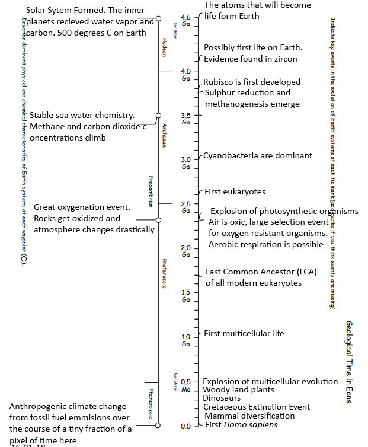
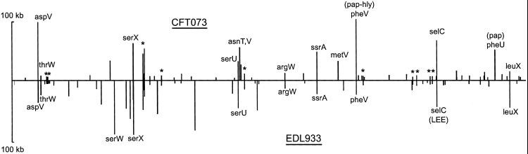

#Portfolio Check
The "done" and "coming soon" statuses are just to help me keep track of what I have put into my main portfolio rmd.
***

## Module 01 Portfolio Content

* Evidence worksheet_01
    + Completion status: Done
    + Comments: 
* Evidence worksheet_02
    + Completion status: Done
    + Comments:
* Evidence worksheet_03
    + Completion status: Done
    + Comments:
* Problem Set_01
    + Completion status: Done
    + Comments:
* Problem Set_02
    + Completion status: Done
    + Comments:
* Writing assessment_01
    + Completion status: Coming soon
    + Comments:
* Additional Readings
    + Completion status:
    + Comments  

### Data Science

* Installation check
    + Completion status: Done
    + Comments:
* Portfolio repo setup
    + Completion status: Done
    + Comments:
* RMarkdown Pretty PDF Challenge
    + Completion status: Done
    + Comments: 
* ggplot
    + Completion status: 
    + Comments: 

## Module 02 Portfolio Content

* Evidence worksheet_04
    + Completion status:
    + Comments:
* Problem Set_03
    + Completion status:
    + Comments:
* Writing assessment_02
    + CANCELED
* Additional Readings
    + Completion status:
    + Comments 
    
## Module 03 Portfolio Content

* Evidence worksheet_05
    + Completion status: Done
    + Comments:
* Problem set_04
    + Completion status:
    + Comments:
* Writing Assessment_03
    + Completion status: Coming soon
    + Comments:
* Additional Readings
    + Completion status:
    + Comments 
    
### Project 1

* CATME account setup and survey
    + Completion status: Done
    + Comments: 
* CATME interim group assessment
    + Completion status: Coming soon
    + Comments:
* Project 1
    + Report (80%): Coming soon
    + Participation (20%):
    
## Module 04 Portfolio Content
### Project 2

* CATME final group assessment
    + Completion status: coming later
    + Comments:
* Project 2
    + Report (80%): coming later
    + Participation (20%):
    
***
# Module 01
## Data science Friday  
### Installation check


### Portfolio repo setup

```{r eval=FALSE}
#created MICB425_portfolio directory on my computer
#created new repository 'MICB_portfolio' on my Github account
git init
git add .
git commit -m "comment text" #comment was 'First commit'
git remode add origin [repository url] #URL was taken from repository page on Github
git remote -v #just to check that URL was correct
git push -u origin master
```

### RMarkdown pretty PDF challenge

```{r child = "DS_assignment3.Rmd"}

```

-----

## Origins and Earth Systems
***
### Evidence worksheet 01 

[Whitman *et al* 1998](https://www.ncbi.nlm.nih.gov/pmc/articles/PMC33863/)

#### Learning objectives
Describe the numerical abundance of microbial life in relation to ecology and biogeochemistry of Earth systems. 

#### General questions
#####What were the main questions being asked?  
+ What amount of carbon mass and nutrients are containted in all the prokaryotes on Earth, and what is the total abundance of prokaryotes globally?  
+ Which environments are significant contributers of prokaryotic biomass and which one is the most important?  
+ How can all of these factors actually be measured?  
+ How can we estimate the uncertainty of said measurements?  
+ What effect does the global microbial population have on biogeochemistry?  

#####What were the primary methodological approaches used? 
+ Available numbers were taken from studies from each small environment. They were converted to the same format and units, then averaged for each environment. Each averaged measurement of an environment was extrapolated to be proportionate to the size of said environment. Then they had to do a fair amount of guesstimation, combined with comparisons to older values to see if their results were within a reasonable order of magnitude. They also calculated the results of sections by different methods to see if all gave the same order of magnitude.

#####Summarize the main results or findings.
+ Nearly all prokaryotic life comes from three main environments: aquatic environments, the subsurface, and soil. About half of the global organic C is contained in microbial cells and 90% of global nutrients. This is 10x the nutrients contained in plants globally. They also determined the turnover rate of cells in each environment.

#####Do new questions arise from the results
+ How likely is their calculated turnver time of thousands of years in the subsurface to be accurate? (Dr Hallam says pretty likely)  
+ Where does energy for life in the subsurface come from? (Dr Hallam says there isn't much in total, but what little there is comes from metal reduction)  
+ Would the averages for each environment change if more measurements were taken in certain places?  
+ Is the biogeochemical effect in the subsurface large, even if the turnover rate, and therefore microbial activity, is so slow?

#####Were there any specific challenges or advantages in understanding the paper (*e.g.* did the authors provide sufficient background information to understand experimental logic, were methods explained adequately, were any specific assumptions made, were conclusions justified based on the evidence, were the figures or tables useful and easy to understand)?
+ I think there were a lot of necessary assumptions made to reach their conclusions, but the reason for each assumption was made clear so I was able to follow the logic of how they reached their conclusions pretty well.

***
###Evidence worksheet 02


***
###Evidence worksheet 03
[Rockstrom 2009](https://www.nature.com/articles/461472a)

####Learning Objectives
* Evaluate human impacts on the ecology and biogeochemistry of Earth systems

#### General questions
#####What were the main questions being asked
* Which Earth-systems have the potential to cause unnaceptable environmental change if pushed too far?
* What variables describe each of these systems?
* What are the "threshold" limits of these variables, where going past would result in too much change to their representative system?
* Which systems are already pushed past their limts?
* How are the values of the limits for the systems past their limits determines?
* Is each individual system stand alone, or interconnected with limits set on the others?

#####What were the primary methodological approaches used?  
* They picked 9 systems that industial human activity has influenced and that they believed had the potential to cause a great deal of harm to global environments. For each system a variable or two measuring change to the system was chosen. Finally a combination of best guesses and comparisons to pre-industrial values was used to find a safe limit for each variable.

#####Summarize the main results or findings.
* The nine systems chosen:
+ climate change  
+ rate of biodiversity loss (terrestrial and marine)  
+ interference with the nitrogen and phosphorus cycles  
+ stratospheric ozone depletion  
+ ocean acidification 
+ global freshwater use  
+ change in land use  
+ chemical pollution  
+ atmospheric aerosol loading

* Systems currentl past limit values:

System            | Variable                   | Limit Value         | Current Value
------------------|----------------------------|---------------------|-----------------------------------
Climate Change    | CO2                        | 350ppm              | 418ppm (387ppm at time of article)
Climate Change    | Radiative Forcing          | 1Wm^-2^             | 1.5W^-2^
Biodiversity Loss | Species Loss Rate          | 10x Background Rate | 100-1000x Background Rate
Nitrogen Cycle    | N2 converted to NO3 or NH4 | 35x10^6^ ton/yr     | 120x10^6^ ton/yr

* They also concluded that all of these systems are so large that they must have effects on each other, so each limit cannot be taken alone in a vacuum.

#####Do new questions arise from the results
* How accurate are the limits and are they useful if not very accurate?
* Are the systems past their limits beyond hope for restoration?
* Where does the balance of human industry for the purpose of survival and the possible catastrophic environmental damage lay? As in, is there a point where stopping environmental damage from reactive nitrogen species runoff save more lives than the food production afforded by modern, fertilizer intensive agriculture saves?

#####Were there any specific challenges or advantages in understanding the paper?
I thought it was quite straight forward. It was pretty haunting to see their quoted atmospheric CO2 concentration and think "Did they get that wrong?" just to realize  this was written 9 years ago and we have already pushed another 30ppm past the limit propposed here.

***
### Problem set 01  
[Whitman *et al* 1998](https://www.ncbi.nlm.nih.gov/pmc/articles/PMC33863/)  

#### Learning objectives: 
* Describe the numerical abundance of microbial life in relation to the ecology and biogeochemistry of Earth systems.

#### Specific questions:
#####What are the primary prokaryotic habitats on Earth and how do they vary with respect to their capacity to support life? Provide a breakdown of total cell abundance for each primary habitat from the tables provided in the text

* Aquatic - The majority of prokaryotic life is found in the open ocean. They have a short turnover time and therefore a high cellular productivity, which means that mutations and other rare genetic events are most likely to occur here than other habitats. 

* Subsurface - Major habitat for prokaryotes, with most of the subsurface biomass supported by organic matter deposited from the surface.

* Soil - Major reservoir of organic carbon; prokaryotes are essential in soil decomposition  
  
Environment     | Aquatic      | Subsurface    | Soil
----------------|--------------|---------------|--------------
Total abundance | $1.18*10^{29}$ | $3.8 x 10^{30}$ | $2.556*10^{29}$

#####What is the estimated prokaryotic cell abundance in the upper 200 m of the ocean and what fraction of this biomass is represented by marine cyanobacterium including Prochlorococcus? What is the significance of this ratio with respect to carbon cycling in the ocean and the atmospheric composition of the Earth?  

* Upper 200m of the ocean: $3.6*10^{28}$
* Density: $5*10^5$ cells/mL

* Fraction represented by cyanobacterium including Prochlorococcus: 8%
* Cyanobacteria: $(4*10^4 cells/ml)/(5*10^5 cells) * 100 = 8%$

* Cyanobacterium such as Prochlorococcus produce their own energy from sunlight via photosynthesis, which in the process produces oxygen while fixing carbon. Despite only being 8% of the prokaryotic cell abundance in the upper 200m, they are responsible for approximately 50% of the oxygen in the atmosphere and contribute greatly to carbon cycling as demonstrated by their quick turnover time, resulting in $8.2 * 10^{29}$ cells/year.


#####What is the difference between an autotroph, heterotroph, and a lithotroph based on information provided in the text?  
* Autotrophs - bacteria that produce their own food, primarily using energy from the sun. In this paper only marine autotrophs are considered, and the overwelming majority of them is said to be _Prochlorococcus_.

* Heterotrophs - use organic carbon as an energy source and carbon source. They are the overwhelming majority of cells on Earth.

* Lithotrophs - prokaryotes that gain energy from something other than organic carbon or sunlight. They are said to be found in small amounts in the subsurface and that organic carbom still sustains most life in the subsurface.

#####Based on information provided in the text and your knowledge of geography what is the deepest habitat capable of supporting prokaryotic life? What is the primary limiting factor at this depth?  
* The Mariana Trench is the deepest part of the ocean at 10.99km depth. According to this paper, temperature  becomses limitting around 4km deep in the ground. Depending on how that temperature/depth dependance scales with bottom depth in the ocean,  I would expect the deepest life to be somewhere in the sediment below the bottom of Mariana Trench. Temperature becomes the limitting factor for life around 125C.


#####Based on information provided in the text your knowledge of geography what is the highest habitat capable of supporting prokaryotic life? What is the primary limiting factor at this height?  
* Mount Everest is the highest point connected to Earth at 8.8km. There is likely prokaryotic life a few meters in the ground near the summit where temperature is stable. This paper mentions cells found as high in the atmosphere as 77km. The ISS definitely has bacteria living inside of the astronauts onboard, if not on surfaces of the craft and that orbits at 408km above sea level. Voyager 1 is currently the furthest man made object above sea level at 21 000 000 000km from Earth. It was sterilized as it was build in 1977, but if any contamination occurred, it could carry the highest living organisms. At altitude carbon becomes a limitting factor if the cells are not photo or litho trophic. UV radiation in the upper atmoshpere or outer space could damage cells.

#####Based on estimates of prokaryotic habitat limitation, what is the vertical distance of the Earth’s biosphere measured in km?  
* I agree witht he paper that the atmosphere should be included in the definition of the biosphere so: 77km above sea level + 11km below sea level = 88km thick biosphere. The densest band would be between -4km and +4km where most of the surface and subsurface life is.

#####How was annual cellular production of prokaryotes described in Table 7 column four determined? (Provide an example of the calculation)  
* Cells/year = Population Size * (turnover/year)  

* For marine autotrophs:  
* $2.9*10^{27}cells * (365(days/year)/1.5days) = 7.1*10^{29}cells/year$

#####What is the relationship between carbon content, carbon assimilation efficiency and turnover rates in the upper 200m of the ocean? Why does this vary with depth in the ocean and between terrestrial and marine habitats?  
* Carbon content along with carbon assimilation efficiency determine the upper limit on the turnover rate. This varies with depth in the ocean, and between terrestrial and marine habitats because the abundance of carbon in each habitat is different. The authors used a calculated turnover rate in the top 200m of the ocean from the amount of net productivity in the ocean and compared it to direct measurements of generation time and turnover rate in the surface ocean. Because these values agreed they calculated turnover time for other environments the same way.

#####How were the frequency numbers for four simultaneous mutations in shared genes determined for marine heterotrophs and marine autotrophs given an average mutation rate of 4 x 10^-7^ per DNA replication? (Provide an example of the calculation with units. Hint: cell and generation cancel out)  

Example for heterotrophic cells in the top 200m  of the ocean:


* 4x10^-7^ mutations/generation
* For 4 mutations to happen at once:
* (4x10^-7)^4^ = 2.56x10^-26^ mutations/generation
* (3.1x 10^28^ cells) x 22.8 = 8.2 X 10^29^ cells/yr
* 365/16  = 22.8 turnover/yr
* (8.2 x 10^29^ cells/ yr) x 2.56 x 10^26^ mutations/yr = 2.1 x 10^4^ mutations/yr
* 1/2.1x10^4^ mutations/year x 365day/year x 24h/year = 0.4 hours per 4 simulataneous mutations

#####Given the large population size and high mutation rate of prokaryotic cells, what are the implications with respect to genetic diversity and adaptive potential? Are point mutations the only way in which microbial genomes diversify and adapt?  
*   A large mutation rate means that there is a great potential for multiple point mutations in a single replication. This allows for quick adaptation by creating a more diverse pool of mutants to be selected from. Genetic diversity will be extremely high when small scale changes to sequence are considered and long term "species" level biodiversity will mostly be determined by competition and environmental pressures. Horizontal gene transfer, plasmid loss, and gene loss can be a significant source of diversity outside of point mutations. HGT likely possesses the highest adaptation potential for a community.

#####What relationships can be inferred between prokaryotic abundance, diversity, and metabolic potential based on the information provided in the text? 
* High abundance allows for high diversity by increasing the potential for mutations and simultaneous mutations. Metabolic potential is dependent on both abundance and diversity. Diversity determines the pool of available genes to be used in metabolic pathways and abundance determines the magnitude of the effect of these pathways. Metabolic potential also influences the community’s mutational potential because it lowers turnover time.

###Problem set 02  

[Falkowski _et al_. 2008](https://www.ncbi.nlm.nih.gov/pubmed/18497287)

####Learning goals
* Discuss the role of microbial diversity and formation of coupled metabolism in driving global biogeochemical cycles.

####General questions
#####What are the primary geophysical and biogeochemical processes that create and sustain conditions for life on Earth? How do abiotic versus biotic processes vary with respect to matter and energy transformation and how are they interconnected?	 
* Tectonic movement along with photochemical reactions in the atmosphere allow for mixing and partitioning of chemical substrates on Earth. 

* Geophysical (abiotic): Tectonics (Acid/base), transfer of protons without electrons, atmospheric photochemical processes (photochemistry/radical chemistry = ‘magic’)
* Biogeochemical(biotic): (Redox)

#####Why is Earth’s redox state considered an emergent property?
* The Earth’s redox state is considered an emergent property because it depends on both geochemical processes and microbial metabolic processes. 

#####How do reversible electron transfer reactions give rise to element and nutrient cycles at different ecological scales? What strategies do microbes use to overcome thermodynamic barriers to reversible electron flow?
* Reversible electron transfer reactions give rise to element and nutrient cycles because of the thermodynamic conditions that make each reaction favorable. Specifically, the rate at which each reaction occurs is determined by the conditions of the environment (i.e. abundance of substrates, products, et. cetera) thus allowing for nutrients to cycle in a stable manner. 

#####Using information provided in the text, describe how the nitrogen cycle partitions between different redox “niches” and microbial groups. Is there a relationship between the nitrogen cycle and climate change?
* The different stages of the nitrogen cycle all require different amounts of oxygen, corresponding to different redox niches, and the other microbes that will be in that environment. In nitrogen fixation, nitrogen gas is fixed from our atmosphere into ammonium. This is done by nitrogenase, which is inhibited by oxygen, yet this is still done in many microbes in aerobic environments. Nitrification, the oxidation of ammonium to nitrite and finally nitrate, happens in aerobic environments. Denitrification, the anaerobic oxidation of nitrate and nitrite to nitrogen gas, occurs in anoxic/anaerobic environments.
Indirectly, the nitrogen cycle is connected to climate change. All microbes require nitrogen to synthesize protein and nucleic acids, and the only method of nitrogen fixation is via microorganisms. The nitrogen cycle is what controls the amount of available fixed nitrogen, which in turn affects the number of microbes carrying out various other reactions, which in turn produces the Earth’s atmosphere. Additionally, if something were to shift in the nitrogen cycle and affect those microbes involved, it would in turn affect the overall microbial community. The nitrogen cycle does not directly affect climate change, as only nitrogen and hydrogen gas are emitted during nitrogen fixation, nitrification, or denitrification, neither of which are greenhouse gases.

#####What is the relationship between microbial diversity and metabolic diversity and how does this relate to the discovery of new protein families from microbial community genomes?
* Although there is enormous genetic diversity in nature, there remains a relatively stable
set of core genes coding for the major redox reactions essential for life and biogeochemical cycles. Thus, microbial diversity does not necessarily entail diversity in proteins involved in metabolism. 

* It is hypothesized that there is limitless evolutionary diversity in nature. The rate of discovery of unique protein families has been proportional to the sampling effort, with the number of new protein families increasing approximately linearly with the number of new genomes sequenced.

#####On what basis do the authors consider microbes the guardians of metabolism?
* Temporary and simultaneous guardianship because of the nature of microbial evolution from horizontal and vertical gene transfer, which can change which phenotype is dominant at the time. A dominant phenotype protects the metabolic pathway in the environment, and if it does not survive environmental perturbations applying selective pressures on pathway genes, then it will disappear. Humans could possibly replicate the individual pathways, but the overall metabolic biogeochemical processes that control the flow of electrons can only be done by microbes.

***
### Module 01 references

Whitman WB, Coleman DC, and Wiebe WJ. 1998. Prokaryotes: The unseen majority. Proc Natl Acad Sci USA. 95(12):6578–6583.  [PMC33863](https://www.ncbi.nlm.nih.gov/pmc/articles/PMC33863/)

Rockstrom. 2009. A safe operating space for humanity. Nature. 461(24). [DOI:10.1038/461472a](https://www.nature.com/articles/461472a)

Falkowski PG, Fenchel T, Delong EF. 2008. The microbial engines that drive Earth's biogeochemical cycles. Science. 320(1034). [DOI:10.1126/science.1153213](https://www.ncbi.nlm.nih.gov/pubmed/18497287)

***
#Module 02
##Remapping the body of the world
***
###Evidence worksheet 04
[Martinez _et al_. 2007](https://www.ncbi.nlm.nih.gov/pmc/articles/PMC1838496/)

####Learning Objectives
* Discuss the relationship between microbial community structure and metabolic diversity
* Evaluate common methods for studying the diversity of microbial communities
* Recognize basic design elements in metagenomic workflows

#### General questions
#####What were the main questions being asked


#####What were the primary methodological approaches used?  

#####Summarize the main results or findings.

#####Do new questions arise from the results

#####Were there any specific challenges or advantages in understanding the paper?


***
### Module 02 references
Martinez A _et al_. 2007. Proteorhodopsin photosystem gene expression enables photophosphorylation in a heterologous host. PNAS. 104(13):5590-95. [DOI: 10.1073/pnas.0611470104](https://www.ncbi.nlm.nih.gov/pmc/articles/PMC1838496/)

###Evidence worksheet 04
[Martinez _et al_. 2007](https://www.ncbi.nlm.nih.gov/pmc/articles/PMC1838496/)

***
#Module 03
##Microbial Species Concepts
***
###Evidence worksheet 05 - Part 1
[Welch _et al_. 2002](https://www.ncbi.nlm.nih.gov/pubmed/12471157)

####Learning Objectives
* Evaluate the concept of microbial species based on environmental surveys and cultivation studies.

* Explain the relationship between microdiversity, genomic diversity and metabolic potential

* Comment on the forces mediating divergence and cohesion in natural microbial communities


#### General questions
#####What were the main questions being asked
* How different are these 3 genomes beyond their 16S sequences?
* What is a microbial species?
* How similar can E. coli be to Salmonella?
* How does selection due to an environment influence transfer of gene islands?
* Should natural environment be used to define a species, or just to define an ecotype?

#####What were the primary methodological approaches used?  
* Random clones were sequenced with dye terminator chemistry (Automated Sanger)  on 3700 machines then assembled with SEQMANII (older contig/scaffold software?) to create a complete genome for the CFT073 strain of E. coli with 7x coverage. Genes from this genome and two other preexisting genomes were annotated using an online system called MAGPIE, where many people could contribute. Genes were predicted based on ORF's and searched on BLAST to automatically annotate any gene that had a match already.

#####Summarize the main results or findings.
* There was a similar backbone (mostly mutated by VGT) in all 3 strains but the strains had many gene islands that were different in each strain. These islands were acquired by horizontal gene transfer and often contain specific genes necessary to survive in the strain's niche environment. For example, many of the islands contain pathogenicity genes that are necessary to infect humans in specifically the urinary tract or the gastrointestinal tract. Some islands contained genes extremely simlar to other genera that infect the same part of a human, like Salmonella. CFT073 doesn’t have type III secretion system or phage/plasmid encoded virulence genes that are common in O157:H7. All three strains have a pilus gene similar to salmonella enterica but amino acid sequence identity is only 53-81%. This means that there are probably different selective pressures on different strains based on selection caused by their specific environment. Only 39% of sequence was shared between all 3 strains but they were considered the same species based ontheir 16S sequences.

#####Do new questions arise from the results
* Do other microbial species have this large of a variance in gene presence between strains?
* Is this variance more common in pathogenic strains?
* Is 16S a reasonable way to classify microbial species, if 3 strains that match to the same species based on 16S, only share 39% of their genes?
* Should environment be considered when defining a species?
* Should strain or ecotype be considered a more important taxonomic classification level than just species?
* Are certain gene islands always correlated with life in a specific environmental niche?
* Can a quantitative species definition cutoff ever be realistic, if sequencing error and differences between strains and even individuals are considered?

#####Were there any specific challenges or advantages in understanding the paper?
* The techniques for data processing were not very clear. Combined with a very brief introduction it made it difficult to follow the connections they were making between their new sequence data and outside sources. However, I do not think this is necessary to be able to understand the important parts of the paper. It isn't really about sequencing a new genome, it is about the larger picture of how species definition and community structure can and should be described.

***
###Evidence worksheet 05 - Part 2
[Welch _et al_. 2002](https://www.ncbi.nlm.nih.gov/pubmed/12471157)

####Learning Objectives
* Comment on the creative tension between gene loss, duplication and acquisition as it relates to microbial genome evolution
* Identify common molecular signatures used to infer genomic identity and cohesion
* Differentiate between mobile elements and different modes of gene transfer

####Question
#####Based on your reading and discussion notes, explain the meaning and content of the following figure derived from the comparative genomic analysis of three E. coli genomes by Welch et al. Remember that CFT073 is a uropathogenic strain and that EDL933 is an enterohemorrhagic strain. Explain how this study relates to your understanding of ecotype diversity. Provide a definition of ecotype in the context of the human body. Explain why certain subsets of genes in CFT073 provide adaptive traits under your ecological model and speculate on their mode of vertical descent or gene transfer.


* The X axis is position along the backbone genome (the whole genome minus island insertion distances). Each vertical deviation is the size of a gene island at that location, and which strain it is present in is shown by direction. An ecotype is a specific version of a species of a microbe that is adapted to a certain niche habitat. In the context of the human body this could be life in the mouth vs life in the gut. The two strains of E. coli here, CFT073 and EDL933, have acquired and retained gene islands that help them survive in the urinary tract or intestinal tract, respectively. Some islands are in both strains. These likely contain genes that are useful just for pathogenic life in the human body, regardless of specific microenvironment. Islands that are only in one strain were likely acquired from other strains or species through horizontal gene transfer. Islands that are present in both strains could be the result of horizontal gene transfer between them, horizontal gene transfer with a third party by both of them, or inherited vertically from a common ancestor.


***
### Module 03 references
Welch _et al_. 2002. Extensive mosaic structure revealed by the complete genome sequence of uropathogenic _Escherichia coli_. PNAS. 99(26). [DOI: 10.1073/pnas.252529799] (https://www.ncbi.nlm.nih.gov/pubmed/12471157)
